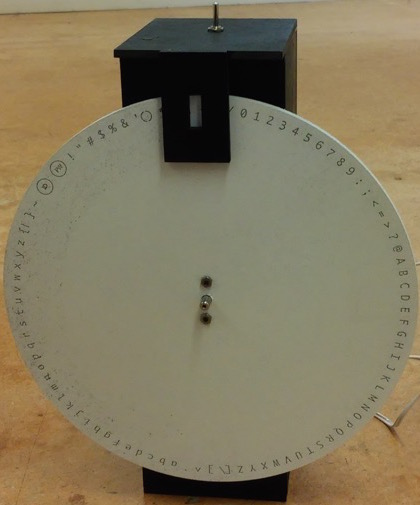
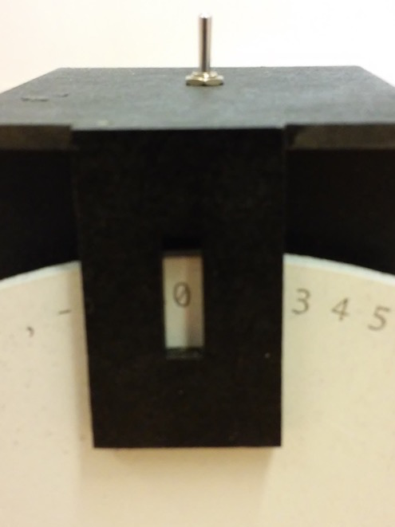

# Oracle Controller

### Object
The object is a wheel with all ASCII characters engraved on it, that rotates to show characters one by one (and an LED to light up said character):





### Hardware requirements
   * 1x Raspberry Pi with SD card and power supply
   * 1x Stepper Motor
   * 1x Stepper driver and power supply for the motor
   * Breadboard, ON-Off Switch, Cable, etc.
   * 1x USB Wifi Card from this list: [http://pwnpi.sourceforge.net/index.html_q=wireless.html](http://pwnpi.sourceforge.net/index.html_q=wireless.html)
   * 4mm MDF, laser cutter, screws, glue & paint


### Software dependencies
   * Operating system: PwnPi (All needed Wifi-Cracking Scripts preinstalled (Aircrack-ng, Reaver etc.), Wifi-drivers patched for injection) [http://pwnpi.sourceforge.net/](http://pwnpi.sourceforge.net/)
   * Wifite.py for automating the wifi-scripts: [https://code.google.com/p/wifite/](https://code.google.com/p/wifite/)


### How to run
This program should be run on a raspberry pi, connected to the oracle wheel (circuit decribed [here](https://upverter.com/bastien.girschig@gmail.com/46dc96200ea85d84/wifiCrakcer/), object images below).
No Build required: simply push "wifite.py" and "oracleController.py" file to the home folder on the raspberry pi, then run:
```
sudo python ~/oracleController.py
```

### Calibration
You will be asked to calibrate the wheel:
```
calibrate ('h' for help): 
```
Using the letters `q`,`Q`,`w`,`W`, rotate it so that it shows the 'PW' character.
Lowercase is for 1 step at a time,capital for 10.
`q` rotates anticlockwise, `w` is for clockwise
you can also type in the number of steps you want to rotate, or turn the wheel manually with the switch on the 'off' position.

When the wheel is in the right position, hit return with nothing written. this will send you to the next step

### Record sequence
You will then be asked if you want to record a new sequence (this is for the demo mode)
```
record new sequence? (y/n)
```
if you want to, type `y` then use the same commands as before. return key with nothing will save the current position and continue on the next one.
when you are done, type `e` to exit the record mode

The sequence will then be played in loop indefinitely.

### Known bugs
- There seems to be a problem with the record sequence phase: looks like missed steps during recording make it completely wrong at play (but stays the same in each loop).
- wifite.py is not connected to the oracleController.py. 

### Credits
Project made by Martin Hertig and Bastien Girschig.
Made during the Botcave workshop at ECAL with Matthew plummer-fernandez. More info about the workshop [here](http://www.iiclouds.org/20141118/iic-workshop-at-ecal-the-birth-of-botcaves/).
